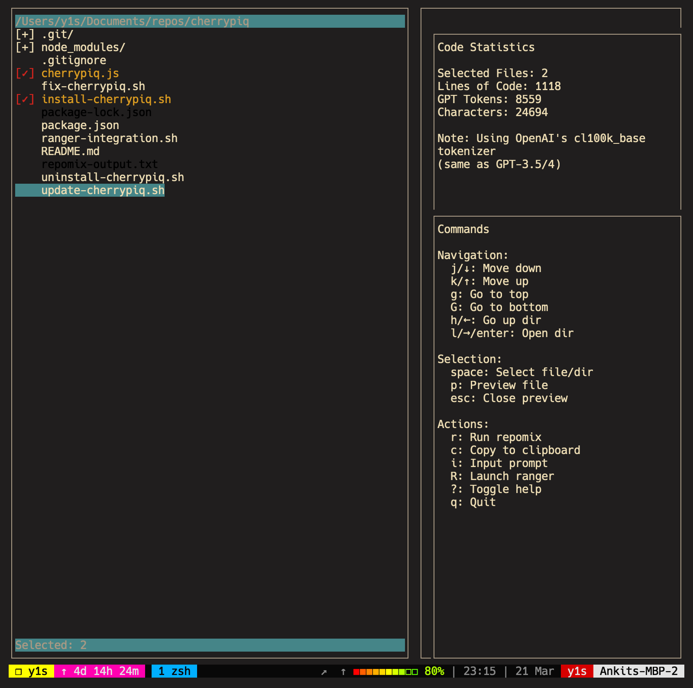

# cherrypiq

An interactive file selector for [Repomix](https://github.com/yamadashy/repomix) with vim-like navigation and Ranger integration.

<p align="center">
  
</p>

## What is this?

cherrypiq is a terminal-based UI tool that lets you:

1. Navigate through your codebase with vim-style keybindings
2. Select specific files/directories to include in your Repomix output
3. Automatically respect .gitignore patterns
4. Integrate with Ranger file manager (if installed)

This makes it much easier to create AI-friendly, focused code snapshots by allowing you to cherry-pick exactly which files to include.

## Installation

```bash
# Quick install with curl
curl -o- https://raw.githubusercontent.com/ya1sec/cherrypiq/main/install.sh | bash

# Or clone and install manually
git clone https://github.com/ya1sec/cherrypiq.git
cd cherrypiq
npm install
npm link
```

## Uninstallation

To uninstall cherrypiq, you can use the provided uninstall script:

```bash
# Quick uninstall with curl
curl -o- https://raw.githubusercontent.com/ya1sec/cherrypiq/main/uninstall-cherrypiq.sh | bash

# Or if you have the repository cloned
cd cherrypiq
./uninstall-cherrypiq.sh
```

The uninstall script will:

- Remove the global npm link for cherrypiq
- Remove the ranger integration (if installed)
- Delete the ~/.cherrypiq directory
- Optionally uninstall global packages (repomix and blessed) that were installed by cherrypiq
- Clean up any temporary files

You can also uninstall manually by:

```bash
# Remove npm global link
npm unlink -g cherrypiq

# Delete cherrypiq directory
rm -rf ~/.cherrypiq

# Remove ranger integration (if it exists)
sudo rm -f /usr/local/bin/ranger-repomix

# Optionally uninstall global packages
npm uninstall -g repomix blessed
```

## Troubleshooting

### 404 Error During Installation

If you see an error like `/opt/homebrew/bin/cherrypiq: line 1: 404:: command not found` when running cherrypiq, it means the installation script failed to download the script properly. To fix this:

1. Run the uninstall script first to clean up the broken installation:

   ```bash
   ./uninstall-cherrypiq.sh
   ```

2. Then reinstall using the local files:
   ```bash
   ./fix-cherrypiq.sh
   ```

This fix script will:

- Remove the broken installation
- Install cherrypiq using the local files in the repository
- Set up the proper symlinks and permissions

### Module Not Found Errors

If you see an error like `Error: Cannot find module 'blessed'` when running cherrypiq, it means the dependencies weren't installed correctly. To fix this:

1. Run the fix script which will properly install all dependencies:

   ```bash
   ./fix-cherrypiq.sh
   ```

2. Or manually install the missing dependencies:
   ```bash
   cd ~/.cherrypiq
   npm install
   ```

### Other Common Issues

- **Permission denied**: If you see permission errors, try running the installation with sudo.
- **Node.js not found**: Make sure Node.js and npm are installed on your system.
- **Ranger integration not working**: Ensure Ranger is installed and the integration script is properly linked.

## Usage

### Basic Usage

```bash
# Navigate to your project directory
cd /path/to/your/project

# Launch the interactive selector
cherrypiq
```

### Key Bindings

| Key        | Action                             |
| ---------- | ---------------------------------- |
| j / down   | Move down                          |
| k / up     | Move up                            |
| g          | Go to top                          |
| G          | Go to bottom                       |
| space      | Toggle selection of file/directory |
| enter      | Open directory                     |
| h / left   | Go up one directory                |
| r          | Run repomix with selected files    |
| R          | Launch ranger (if installed)       |
| q / Ctrl+c | Quit                               |

### Ranger Integration

If you have [Ranger](https://github.com/ranger/ranger) installed, you can also use it for file selection:

```bash
# Launch ranger with repomix integration
ranger-repomix
```

Inside Ranger:

- Use `space` to mark/unmark files
- Press `,r` to run repomix with selected files
- Press `,h` for help
- Press `,c` to clear selection

## Features

- **Vim-like Navigation**: Familiar keybindings for efficient movement
- **.gitignore Aware**: Automatically grays out and excludes files in .gitignore
- **Interactive UI**: Visual feedback on selected files
- **Ranger Integration**: Leverage Ranger's powerful file management features
- **Directory Selection**: Select entire directories at once

## Requirements

- Node.js 14+ and npm
- Repomix (`npm install -g repomix`)
- Optional: Ranger file manager

## How It Works

cherrypiq reads your .gitignore file to determine which files should be excluded. It then provides an interface for you to navigate your codebase and select specific files/directories to include in the Repomix output.

When you select files and run repomix, it uses the `--include` flag to specify exactly which files to process, allowing for more focused and relevant AI analysis.

## License

MIT
